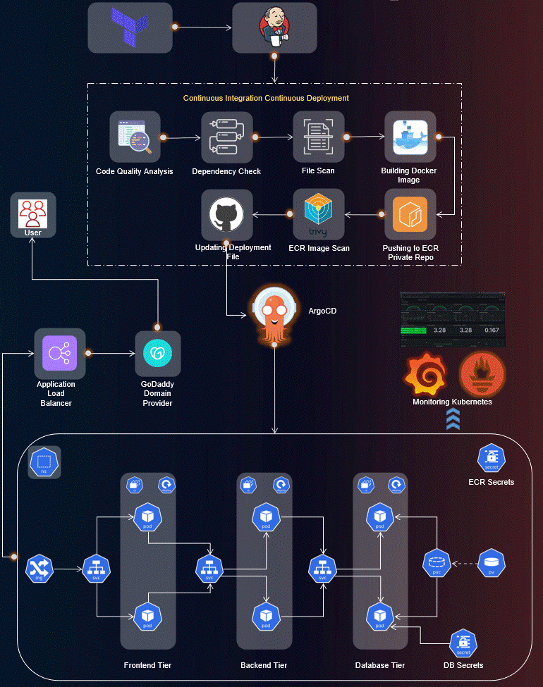

# Three-Tier Web Application Deployment on AWS EKS using AWS EKS, ArgoCD, Prometheus, Grafana, and Jenkins

Welcome to the Three-Tier Web Application Deployment project! 🚀

This repository hosts the implementation of a Three-Tier Web App using ReactJS, NodeJS, and MongoDB, deployed on AWS EKS. The project covers a wide range of tools and practices for a robust and scalable DevOps setup.

## Table of Contents
- [Application Code](#application-code)
- [Jenkins Pipeline Code](#jenkins-pipeline-code)
- [Jenkins Server Terraform](#jenkins-server-terraform)
- [Kubernetes Manifests Files](#kubernetes-manifests-files)
- [Project Details](#project-details)

## Application Code
The `Application-Code` directory contains the source code for the Three-Tier Web Application. Dive into this directory to explore the frontend and backend implementations.

## Jenkins Pipeline Code
In the `Jenkins-Pipeline-Code` directory, you'll find Jenkins pipeline scripts. These scripts automate the CI/CD process, ensuring smooth integration and deployment of your application.

## Jenkins Server Terraform
Explore the `Jenkins-Server-TF` directory to find Terraform scripts for setting up the Jenkins Server on AWS. These scripts simplify the infrastructure provisioning process.

## Kubernetes Manifests Files
The `Kubernetes-Manifests-Files` directory holds Kubernetes manifests for deploying your application on AWS EKS. Understand and customize these files to suit your project needs.

## Project Details
🛠️ **Tools Explored:**
- Terraform & AWS CLI for AWS infrastructure
- Jenkins, Sonarqube, Terraform, Kubectl, and more for CI/CD setup
- Helm, Prometheus, and Grafana for Monitoring
- ArgoCD for GitOps practices

🚢 **High-Level Overview:**
- IAM User setup & Terraform magic on AWS
- Jenkins deployment with AWS integration
- EKS Cluster creation & Load Balancer configuration
- Private ECR repositories for secure image management
- Helm charts for efficient monitoring setup
- GitOps with ArgoCD - the cherry on top!

## Jenkins Build for Frontend

## Jenkins Build for Backend

## Sonar Scanning of Code Analaysis

## Private ECR Repo

## AWS Load Balancers for Monitoring & GitOps

## EKS Nodes with Jenkins Master

## Graffana Dashboard

## Prometheus Dashboard

## ArgoCD deployment

📈 **The journey covered everything from setting up tools to deploying a Three-Tier app, ensuring data persistence, and implementing CI/CD pipelines.**

## License
This project is licensed under the [MIT License](LICENSE).

Happy Coding! 🚀
